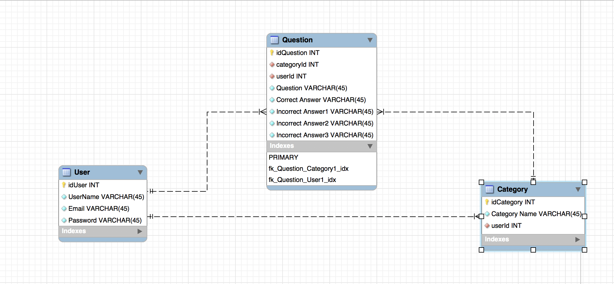

# Trivia Brain

## What is Trivia Brain?
This is a Trivia App that displays trivia info in flashcard format. Trivia Brain presents the user with 10 default categories for use as well as the ability to create your own categories and questions for the user to play. The default categories pull questions from an external API called Open Trivia while the user categories and questions are stored in a JSON server. Therefore the user can Add, Delete and Edit their questions.

## Technologies Used
* [React](https://github.com/facebook/create-react-app/) - The JavaScript Library used to create the App
* [Reactstrap](https://reactstrap.github.io/) - Used for styling
* [Open Trivia API](https://opentdb.com/api_config.php) - The External API used
* [JSON Server](https://github.com/typicode/json-server) - Database used to store user information
* [he](https://github.com/mathiasbynens/he) - NPM install used to decode the information from Open Trivia
* [Canva](https://www.canva.com/) - Design site used to make the Logo

## Getting Started
To run the Trivia Brain on your local computer
1. First you must clone or fork this Repository
2. Run `npm install` or `$ npm install` from your terminal inside the project directory (`/trivia-app`)
3. Run `npm start` or `$ npm start` from your terminal inside the project directory (`/trivia-app`) to start the React App
4. In a seperate terminal window run move into the api directory `/trivia-app/api` `json-server -p 5002 -w database.json` or `$ json-server -p 5002 -w database.json`
5. Start learning Trivia

## Data Structure

